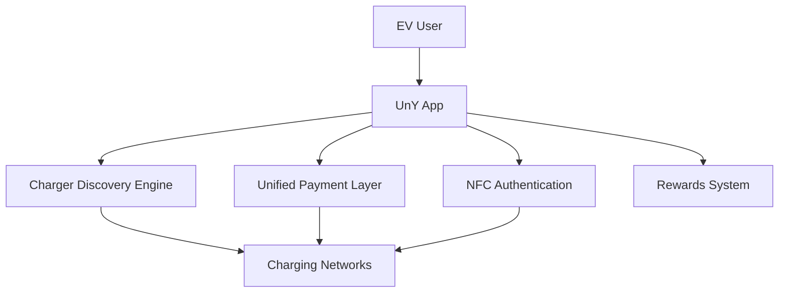

<div align="center">

<p align="center">
  
</p>
<p align="center">
  
</p>
</div>

# 🌍 The Problem

The EV ecosystem is growing rapidly, but the charging experience is still fragmented.

Today's EV users often need:
  - multiple apps
  - multiple wallets
  - different payment systems
  - different charging flows

And even after all that...

  ⚠️ payments fail  
  ⚠️ sessions timeout  
  ⚠️ charger discovery becomes confusing  
  ⚠️ user experience feels outdated  

---

# 💡 Our Vision

# Building India’s Connected EV Infrastructure

A platform where users can:
- discover chargers
- connect with multiple charging networks
- make seamless payments
- use NFC offline access
- enjoy a premium user experience
 
---

# 🚀 Core Features

<table>
<tr>
<td width="53%">

## 🔍 Universal Charger
- Multi-network charger listing
- Connector filters
- Smart map interface
- Nearby charger suggestions


</td>

<td width="55%">

## 💳 Unified Pay's
- UPI-first architecture
- Single payment flow
- Wallet & card support
- Fast charging payments


</td>
</tr>

<tr>
<td width="53%">

## 📡 Offline NFC Pay
- Tap-to-pay charging
- Low network dependency
- Instant authentication
- Future EV identity system


</td>

<td width="59%">

## 🎁 Reward system
- Cashback systems
- Reward points
- Referral systems
- Subscription models


</td>
</tr>
</table>

---

# 🎨 Design Philosophy

UnY is being designed with a strong focus on:

```bash
✓ Minimalism
✓ Soft Curvy UI
✓ Premium Motion Design
✓ Low Friction UX
✓ Fast Interactions
✓ Accessibility
```

### Inspired by:
- modern fintech apps
- soft paper UI systems
- premium mobility ecosystems


---

# 📱 User Experience Goals

We want EV charging to feel as smooth as:

- scanning a UPI QR
- booking a cab
- Tapping a Debit/Credit card

Instead of:
- “Which app do I need this time?” 
- “Do I have proper Network”


---

# 🏗️ Planned Architecture



---

# 🧠 Why This Matters

Current EV ecosystem problems:

| Problem | Current Situation |
|---|---|
| Fragmented apps | Different app for every charger |
| Payment inconsistency | Different wallets & flows |
| Poor UX | Infrastructure-first approach |
| Internet dependency | Charging friction in weak networks |
| Lack of ecosystem | No unified EV identity |

---

# 🎯 Our Goal

To create a connected EV ecosystem where:
- Users experience frictionless charging
- Charging providers gain better accessibility
- Payments become faster and more reliable

can work seamlessly together.

---

# 🛣️ Roadmap

## 🚀 Phase 1
- Charger aggregation
- Unified payment experience
- Premium UI/UX system

---

## ⚡ Phase 2
- NFC infrastructure
- Rewards ecosystem
- Smart charging flows

---

## 🌍 Phase 3
- Real-time analytics
- Reservation systems
- Fleet integrations
- EV infrastructure APIs

---

# 💼 Business Direction

Potential monetization:
- transaction fees
- NFC card ecosystem
- premium memberships
- infrastructure partnerships
- analytics & software services

---

# 🧩 Planned Tech Stack

| Layer | Technology |
|---|---|
| Frontend | Flutter |
| Backend | Node.js |
| Database | PostgreSQL |
| Payments | Razorpay / UPI / NFC Card |
| Authentication | Firebase/Auth0 |
| Maps | Google Maps API |
| NFC | Native Device Integration |

---

# 🤝 Collaboration

Currently in:
- research
- planning
- product architecture
- UX exploration phase

Open to collaborating with:
- developers
- UI/UX designers
- EV enthusiasts
- infrastructure experts
- fintech builders

---

<div align="center">

## 🚗⚡Lets Change Future of EV Charging.
---
</div>
